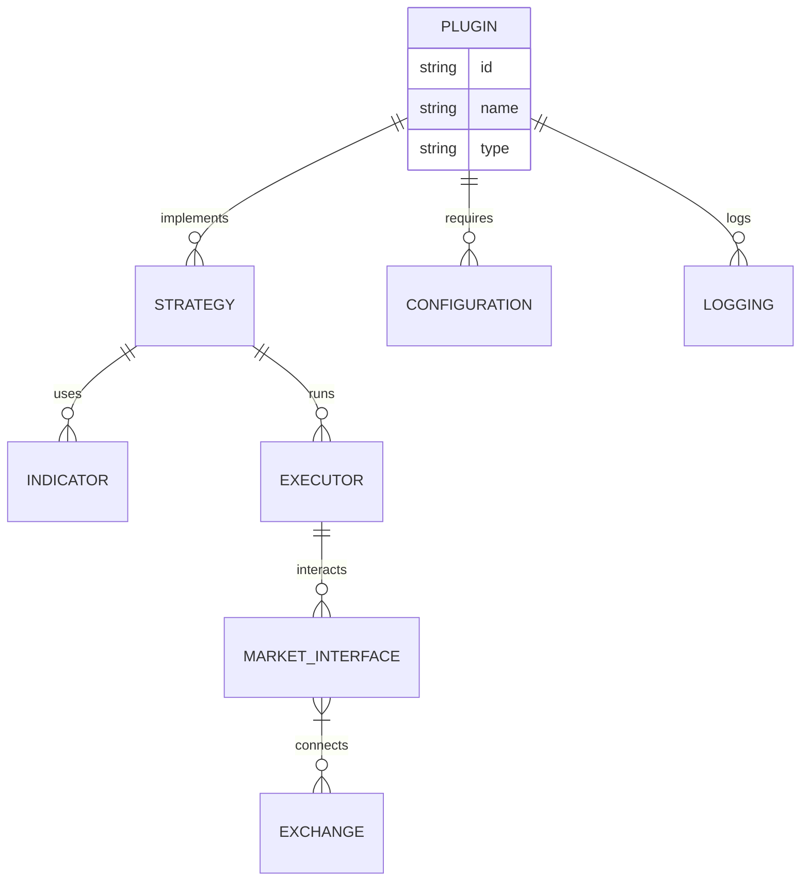

# VeighNa - Financial Chat.

<p align="center">
  
</p>

<p align="center">
    
    
    
    
    
</p>


## Why Financial Chat?
VeighNa is a Python-based open source quantitative trading system development framework that has grown step by step into a fully-featured quantitative trading platform with continuous contributions from the open source community. It currently has many users from domestic and international financial institutions, including hedge funds, investment banks, futures brokers, university research institutions, proprietary trading companies, etc. **The VeighNa Elite Quantitative Terminal for professional traders has been officially released, providing comprehensive support for professional traders' needs in areas such as massive strategy concurrency, intelligent position rolling, algorithmic order execution, multi-account trading support, and more. For more detailed information, please scan the QR code below and follow the account, then click on the menu bar's [Community Exchange -> Elite Member Services]**

They are:
- 🔌 Modular & reusable components
- 📦 Environment-agnostic (backtest, sandbox, live)
- 🧩 Easy to plug into any strategy or workflow
- 🌐 Exchange-agnostic with unified interfaces

Create, share, or combine for indicators, strategies, risk controls, and more — all while keeping your code clean and scalable.


## AI-Powered

On the tenth anniversary of VeighNa's release, version 4.0 officially introduces the module targeting AI quantitative strategies, providing professional quantitative traders with **an all-in-one multi-factor machine learning (ML) strategy development, research, and live trading solution**:

## Financial Chat Workspace

While the Financial Chat Platform is all about an integration to dozens of different data vendors, the interface is either Python or a CLI.

If you want an enterprise UI to visualize this datasets and use AI agents on top, you can find Financial Chat Workspace at.

* :bar_chart: **dataset**: Factor Feature Engineering

    * Designed specifically for ML algorithm training optimization, supporting efficient batch feature calculation and processing
    * Built-in rich factor feature expression calculation engine, enabling rapid one-click generation of training data
    * Alpha 158: A collection of stock market features from Microsoft's Qlib project, covering multiple dimensions of quantitative factors including K-line patterns, price trends, and time-series volatility

* :bulb: **model**: Prediction Model Training

    * Provides standardized ML model development templates, greatly simplifying model building and training processes
    * Unified API interface design, supporting seamless switching between different algorithms for performance comparison testing
    * Integrates multiple mainstream machine learning algorithms:
        * Lasso]: Classic Lasso regression model, implementing feature selection through L1 regularization
        * LightGBM: Efficient gradient boosting decision tree with a training engine optimized for large-scale datasets
        * MLP: Multi-layer perceptron neural network, suitable for modeling complex non-linear relationships


```js
function signIn(password, twoFactorAuthCode) {
    Onyx.merge(ONYXKEYS.ACCOUNT, {isLoading: true});
    Authentication.Authenticate({
        ...defaultParams,
        password,
        twoFactorAuthCode,
    })
        .then((response) => {
            Onyx.merge(ONYXKEYS.SESSION, {authToken: response.authToken});
        })
        .catch((error) => {
            Onyx.merge(ONYXKEYS.ACCOUNT, {error: error.message});
        })
        .finally(() => {
            Onyx.merge(ONYXKEYS.ACCOUNT, {isLoading: false});
        });
}
```

## Features

- Fetches financial data using OpenBB
- Generates technical analysis summaries using AI
- Provides stock price history, quantitative stats, and more
- Calculates relative strength for stocks
- Sentiment analysis on news articles
- Universe scanning using FinViz filters
- Risk management techniques using technically-derived stops and R Multiples
- Interactive Streamlit UI for chat-based interaction
- Multiple Agent Workflows using LangGraph
- Deployment to AWS with the Copilot CLI

## 🛠️ Installation

In addition to the graphical start-up method based on VeighNa Station, you can also create run.py in any directory and write the following sample code:

```javascript
// Bad
validateAndSubmitForm() {
    // validate...
    this.setState({isLoading: true});
    signIn()
        .then((response) => {
            if (result.jsonCode === 200) {
                return;
            }

            this.setState({error: response.message});
        })
        .finally(() => {
            this.setState({isLoading: false});
        });
}

// Good
validateAndSubmitForm() {
    // validate...
    signIn();
}
```




<p align="center">
    
</p>

<p align="center">
  </center>
</p>

## Contributors

 wouldn't be  without you. If we are going to disrupt financial industry, every contribution counts. Thank you for being part of this journey.

<a href="https://github.com/Financial Chat-finance/Financial Chat/graphs/contributors">
   
</a>
