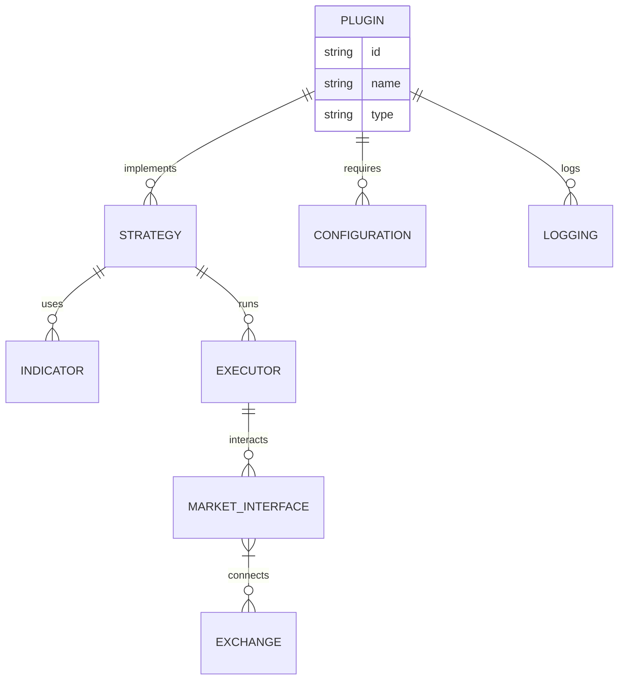

<br />

<p align="center">
  
</p>


[](https://discord.com/invite/xPHTuHCmuV)
[](https://vscode.dev/redirect?url=vscode://ms-vscode-remote.remote-containers/cloneInVolume?url=https://github.com/OpenBB-finance/OpenBB)
<a href="https://codespaces.new/OpenBB-finance/OpenBB">
  
</a>
<a target="_blank" href="https://colab.research.google.com/github/OpenBB-finance/OpenBB/blob/develop/examples/googleColab.ipynb">
  
</a>
[](https://pypi.org/project/openbb/)


## Why Maybe Plugins?
Maybe Plugins let you **build once, use anywhere** across backtests, paper trading, and live markets.


They are:
- 🔌 Modular & reusable components
- 📦 Environment-agnostic (backtest, sandbox, live)
- 🧩 Easy to plug into any strategy or workflow
- 🌐 Exchange-agnostic with unified interfaces

Create, share, or combine plugins for indicators, strategies, risk controls, and more — all while keeping your code clean and scalable.

<summary><h2> What Can I Do with Maybe?</h2></summary>

Maybe offers a modular, open-source payments infrastructure designed for flexibility and control. Apart from our Payment Suite offering, this solution allows businesses to pick and integrate only the modules they need on top of their existing payment stack — without unnecessary complexity or vendor lock-in.

Each module is independent and purpose-built to optimize different aspects of payment processing.

### Trade Stocks, Crypto, Futures, and Forex

```python
import Maybe
"""
This example shows how backtest over tweets
"""

class TwitterBot(Maybe.Model):
    def main(self, args):
        while self.has_data:
            self.backtester.value_account()
            self.sleep('1h')

    def event(self, type_: str, data: str):
        # Now check if it's a tweet about Tesla
        if 'tsla' in data.lower() or 'gme' in data.lower():
            # Buy, sell or evaluate your portfolio
            pass


if __name__ == "__main__":
    exchange = Maybe.Alpaca()
    model = TwitterBot(exchange)

    # Add the tweets json here
    model.backtester.add_custom_events(Maybe.data.JsonEventReader('./tweets.json'))
    # Now add some underlying prices at 1 month
    model.backtester.add_prices('TSLA', '1h', start_date='3/20/22', stop_date='4/15/22')

    # Backtest or run live
    print(model.backtest(args=None, initial_values={'USD': 10000}))

```

## 🛠️ Installation

Follow the steps below to install and run this project on your local machine.

### 1. 📦 Prerequisites

Make sure you have the following tools installed on your system:

- [Node.js](https://nodejs.org/)  (v14.x or newer)
- [npm](https://www.npmjs.com/)  (comes with Node.js)
- [Git](https://git-scm.com/) 
- Python 3.x (optional, if any indicators or tools require it)

> You can also use Docker to run the project in an isolated environment.

### 3. 📦 Install Dependencies

Install the required npm packages:

```bash
npm install
```

If the plugin uses Python-based tools or indicators, install the Python dependencies as well:

```bash
pip install -r requirements.txt
```

---

### 4. 🔐 Set Up Exchange API Keys

To allow the plugin to interact with cryptocurrency exchanges, set up your API credentials.

Create a `.env` file in the root directory and add your exchange keys:

```env
EXCHANGE_API_KEY=your_api_key_here
EXCHANGE_SECRET_KEY=your_secret_key_here
```

> Make sure not to commit this file to version control. It should remain private.

---

### 5. ⚙️ Configure the Plugin

Each plugin comes with a configuration file. For example:

```yaml
# config/rsi-config.yaml
strategy:
  rsi_period: 14
  overbought_threshold: 70
  oversold_threshold: 30
  symbol: BTC/USDT
  interval: "1h"
```

You can modify these values based on your trading preferences.

---

### 6. ▶️ Run the Plugin

Once everything is set up, start the plugin:

```bash
npm start -- --plugin rsi --config config/rsi-config.yaml
```

Or, if you're using a custom script:

```bash
node index.js --plugin rsi --config config/rsi-config.yaml
```

---

### 7. 🐳 Optional: Run with Docker

Build and run the plugin using Docker:

```bash
docker build -t Maybe-rsi-plugin .
docker run -it --env-file .env Maybe-rsi-plugin
```




<p align="center">
    
</p>

<p align="center">
  </center>
</p>

## Contributors

 wouldn't be  without you. If we are going to disrupt financial industry, every contribution counts. Thank you for being part of this journey.

<a href="https://github.com/OpenBB-finance/OpenBB/graphs/contributors">
   
</a>
